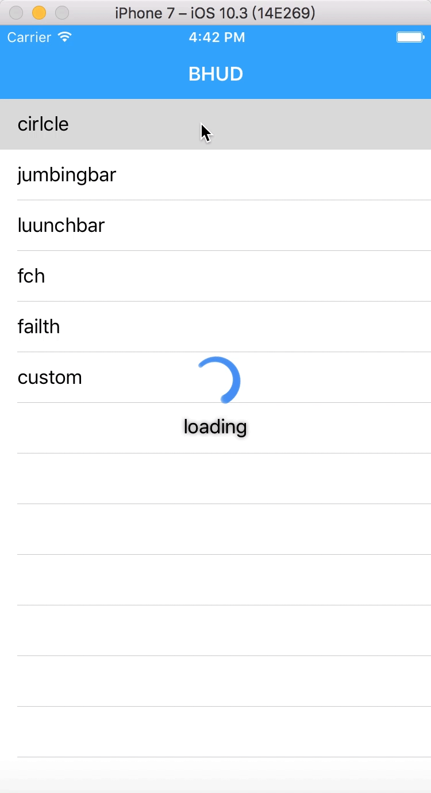
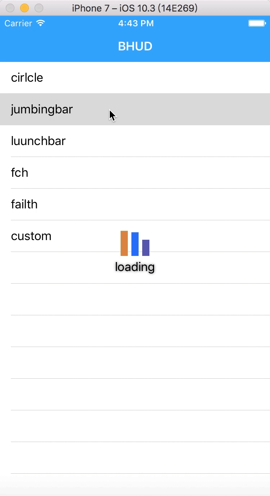
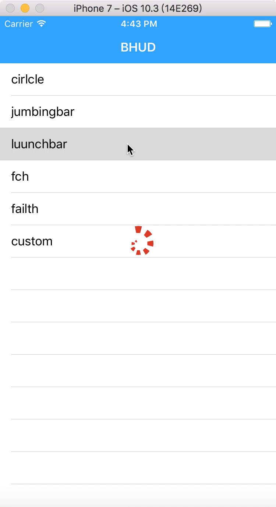
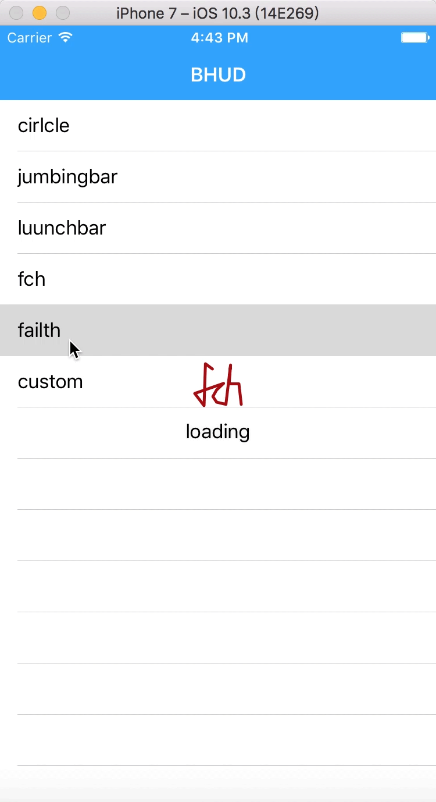

# BHUD
加载框显示工具


<div align=center>
 
 


 
 

</div>


## 集成说明
### pod
```
pod 敬请期待
```

### 手动集成
拖入BHUD文件夹

## 基本说明
引入头文件
```
#import "BHudView.h"
```
### 显示indicatorInView和lable
```
[BHudView showHudInView:self.view];
或者
[BHudView showHudInView:self.view indicatorViewStyle:BHudJumpBarIndicatorView];
```
### 显示indicatorInView
```
[BHudView showIndicatorInView:self.view];
或者
[BHudView showIndicatorInView:self.view indicatorViewStyle:BHudLaunchBarIndicatorView];
```
### 显示错误
```
 [BHudView showErrorInView:self.view clickBlock:^{
                        [BHudView hideHudInView:self.view];
                    }];

```

## 高级用法
自定义用法
```
 UIView *customView = [[UIView alloc]initWithFrame:CGRectMake(200, 200, 200, 200)];
        [customView setBackgroundColor: [UIColor greenColor]];
        [BHudView showCustomHudView:customView InView:self.view];

```

